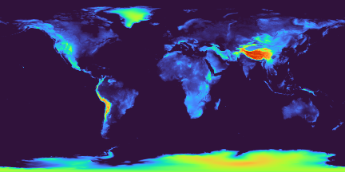

# What Time Zone Should Countries Be?

This module makes heavy use of [PyEphem](https://github.com/brandon-rhodes/pyephem) - you should checkout [the quick reference](https://rhodesmill.org/pyephem/quick.html).
