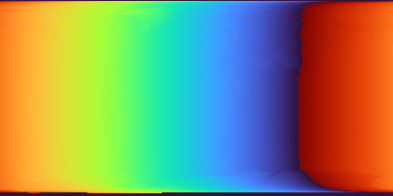
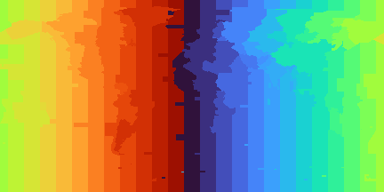

# What Time Zone Should Countries Be?

## Maps

### Step 1: Elevation

### Step 2: Sunrise/Noon/Sunset

### Step 3: Time Zones

### Step 4: Difference Between Noon And Time Zones

(to do)

## Comments

Note how the poles' sunrise and sunset are affected by the Earth being tilted (either total darkness or total light) but that solar noon isn't . Also note how the elevation of the ground affects sunrise and sunset but not solar noon.

## External Packages

This module makes heavy use of [PyEphem](https://github.com/brandon-rhodes/pyephem) - you should checkout [the quick reference](https://rhodesmill.org/pyephem/quick.html).
