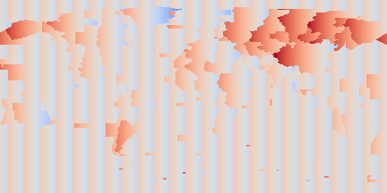

# What Time Zone Should Countries Be? (WTZSCB)

This repository contains a few Python scripts to answer the question "What Time Zone Should Countries Be?" in support of [a recent blog post](https://thomasguymer.co.uk/blog/2019/2019-07-06/) of mine.

## Maps

### Step 1: Elevation

### Step 2: Sunrise/Noon/Sunset

### Step 3: Time Zones

### Step 4: Difference Between Noon And Time Zones

## Comments

Note how the poles' sunrise and sunset are affected by the Earth being tilted (either total darkness or total light) but that solar noon isn't. Also note how the elevation of the ground affects sunrise and sunset but not solar noon.

## Dependencies

WTZSCB requires the following Python modules to be installed and available in your `PYTHONPATH`.

* [cartopy](https://pypi.org/project/Cartopy/)
* [ephem](https://pypi.org/project/ephem/)
* [matplotlib](https://pypi.org/project/matplotlib/)
* [numpy](https://pypi.org/project/numpy/)
* [pyguymer3](https://github.com/Guymer/PyGuymer3)
* [requests](https://pypi.org/project/requests/)
* [shapely](https://pypi.org/project/Shapely/)

WTZSCB uses some [Global Self-Consistent Hierarchical High-Resolution Geography](https://www.ngdc.noaa.gov/mgg/shorelines/) resources and some [Natural Earth](https://www.naturalearthdata.com/) resources via the [cartopy](https://pypi.org/project/Cartopy/) module. If they do not exist on your system then [cartopy](https://pypi.org/project/Cartopy/) will download them for you in the background. Consequently, a working internet connection may be required the first time you run WTZSCB.

## External Packages

This repository makes heavy use of functions from [PyEphem](https://github.com/brandon-rhodes/pyephem) - you should checkout [the quick reference](https://rhodesmill.org/pyephem/quick.html) to see the things that it can do. Data is provided by [Natural Earth](https://www.naturalearthdata.com/) and [GLOBE](https://www.ngdc.noaa.gov/mgg/topo/globe.html). Whilst this repository doesn't use it directly, [the CIA World Factbook](https://www.cia.gov/library/publications/resources/the-world-factbook/) has [a nice PDF map of the world time zones](https://www.cia.gov/library/publications/the-world-factbook/graphics/ref_maps/physical/pdf/standard_time_zones_of_the_world.pdf) to compare against.
